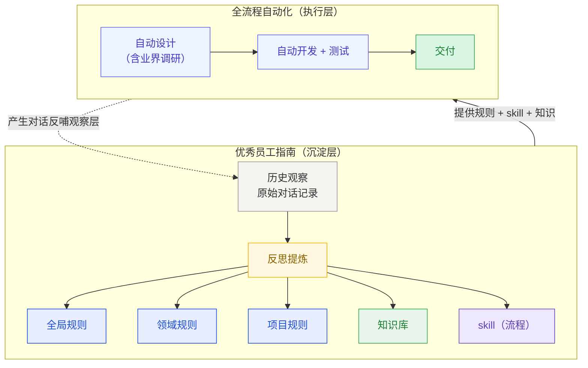
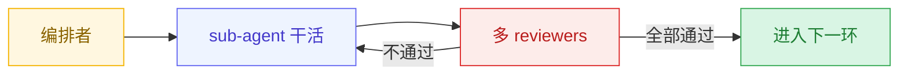
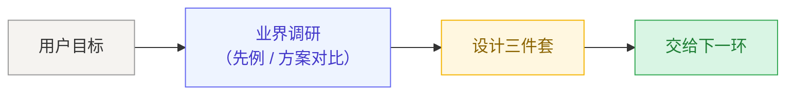
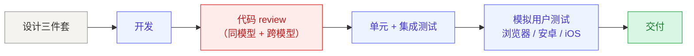

# 如何把 AI Agent 打造成一名优秀员工——质量不降的前提下，持续降低老板介入频率

最近不少公众号粉丝问我：3 月份平均每天 6 亿 token，怎么烧掉的？今天就来揭秘。

现如今，AI Coding 早已成为程序员标配，但个人瞎扯一句（轻喷），AI Coding 用的好不好只有一个衡量标准： **不降低交付质量的前提下，减少与用户的沟通。** 如果在完成一个需求的过程中，频繁与 Agent 沟通，那说明在把 Agent 当做聊天机器人。

要达到上述目标，就需要把 AI Agent 当成员工，用户是老板——让互动模式逼近"老板 - 优秀员工"：

- 老板下达目标
- 员工独立交付结果
- 交付物符合所有规则
- 犯过的错，沉淀成规则或流程，下次自动避开

这正是优秀员工应该达到的水平。

一个优秀员工之所以优秀，靠的是两件很朴素的事：**心里装着一套做事的规矩，做事时遵循一套成熟的流程，并随着经验积累持续完善。** 放到 AI agent 身上也一样——它需要一份**优秀员工指南**：规则告诉它什么该做什么不该做，skill 告诉它某类任务按什么流程走，知识库提供背景事实。指南越贴合你，使用时它越像你的老搭档。

## 两层结构

| 层 | 定义 | 容忍度 |
|---|---|---|
| **硬前提：交付质量** | 通过多轮循环 Review 的方案保证所有交付的结果符合所有规则 | 零容忍 |
| **软目标：降低介入频率** | 质量达标前提下，同类任务的人工介入频率随时间下降 | 趋势必须向下 |

**质量是底线。** 优先级：消除硬失败 > 降低软失败频率。任何改进若会增加硬失败，必须回滚。

这套循环 Review 机制代价明显——token 会成倍涨，顶级模型也不便宜。但反过来问一句：**难道我花钱买的 Token，让我自己去一轮轮 review AI 的产出、替它找问题吗？**

说到这里不妨泼一瓢冷水。这两年 AI 火起来之后，网络上轮番炒作过一堆听起来像是新学科的词——**prompt engineering**、**context engineering**、再到 2026 年又冒出来的 **harness engineering**。名字换了一茬又一茬，但剥掉包装，大家真正在做的事情其实就两件：**把规矩写清楚喂给模型，再搭一套机制让 Agent 交付前自己把关。**

### 具体量化指标（按需求复杂度分级）

不追求严格精确，给出可感知的阈值：

| 需求类型 | 从提出到 merge 的用户消息轮次 |
|---|---|
| 简单且明确的需求（如 bug 修复、小功能追加、文档改动） | **≤ 3 轮** |
| 中等需求（涉及设计决策、跨文件修改） | **≤ 10 轮** |
| 复杂需求（架构性变更、跨项目） | 不设硬上限，但趋势应下降 |

"轮次"=用户主动发送消息的次数，不含 agent 回复。澄清、纠正、补充规则、返工要求、review 反馈都计入。

这是**系统健康度的体温计**：简单需求常态化需要 5+ 轮，系统有问题。

## 四条硬约束

### 1. 澄清优先于硬猜

目标有歧义且会影响交付质量时，agent 必须问清楚再开工。宁可多问，不得带歧义硬干。

### 2. 质量优先于少打扰

agent 无法保证交付质量时，**必须交回用户，不得降级交付**。

### 3. 交付前必须无违规

产出在交付前必须通过完整 review 循环且不违反任何已写下的规则。允许过程中犯错，不允许未自愈就交付。

### 4. 严格禁止把 Agent 当聊天机器人用

每个环节都要考虑：怎么让用户脱离参与、同时 AI 还能保证质量。

| 阶段 | Bad case（聊天机器人模式） | Good case（员工模式） |
|---|---|---|
| 需求澄清 | 零散挤牙膏、反复多轮来回 | 每一轮都主动把范围缩小：提出一组具体选项或前置假设让用户确认，而不是开放式提问让用户想 |
| 设计 | AI 出初稿 → 用户挑错 → AI 改 → 用户再挑 | AI 自己查网络、调研业界方案、看同类项目怎么实现；自己产出三件套；编排者 + reviewer 循环到合格再交付 |
| 开发 + 测试（同一循环） | AI 写一段让用户 review 一段；AI 改完让用户"测一下看看"；测试没过用户报 bug 再改 | 开发必须包含测试——测试没过就是开发没过。AI 自己写、自己跑单元 / 集成 / 端到端测试、自己做代码 review、调 reviewer 交叉验证；用浏览器、安卓、iOS 控制工具自己模拟真实用户操作；测试全过才算开发完成 |
| 交付前 | 用户充当 QA，肉眼扫产物 | AI 自己确认产物符合所有规则，交付即终态 |
| 真正需要用户 | "你看这个行不行"、"有没有问题"、"测一下" | 需求本身变化、偏好选择、跨场景权衡、能力边界之外的判断 |

## 完整拼图

### 图一：整体结构（服务于 north star：质量不降 + 持续降低介入频率）

图中实线是指南喂养执行，虚线是执行反哺指南。**虚线是防重复犯错的机制**——不是 agent 变聪明，是它不再重复踩坑。没有这个反哺，"持续降低"就是空话。

### 图二：每个环节内部的合规循环（所有编排者 skill 共享的骨架）

图一主干中的每个环节背后都是一个 skill（自动设计的 skill、自动开发 + 测试的 skill 等）。这些 skill 内部都严格遵循下面这个合规循环——它不是某一个 skill 的私有流程，而是所有编排者共享的骨架：

"多 reviewers" 必须同时包含两个维度：

- **同模型的多 reviewers**：多个 sub-agent（同模型、不同视角 / 不同 prompt）并行 review
- **跨模型（跨厂商）reviewers**：产物必须经过至少一个**不同模型/不同厂商**的 review，例如 Claude 产物由 Codex review、Codex 产物由 Claude review

为什么必须要跨模型？同一模型有系统性盲区——同一偏好、同一薄弱点、同一跳步倾向会同时出现在产物和 review 中，导致问题被一起忽略。**实战中反复观察到：本模型发现不了的问题，跨模型经常能发现**——这不是理论推断，是重复出现的现象。

### 图三：自动设计

自动设计不是一把产出，内部有自己的子流程：先业界调研看先例，再沉淀成**设计三件套**，作为开发测试阶段的参考依据。外面套着编排者的合规循环。

### 图四：自动开发 + review + 测试

这一环才是交付的硬骨头。写代码只是开始——后面还有代码 review、自动化测试、模拟真实用户的端到端验证，外面同样套着编排者的合规循环。

## 为什么每个人都该尽早投资自己的优秀员工指南

世界上没有两个人是一样的——编码偏好、沟通风格、对"好产出"的定义都不同。**通用模型永远不可能真正理解你**：凭什么一个从没见过你代码、没听过你吐槽、不知道你上次为什么纠正过它的模型，能和你配合得像老搭档？

唯一的路径是让 AI agent 拥有属于你的私人优秀员工指南——**越早投资、越持续投资，指南越贴合你，使用时它越不打扰你**。从今天开始，每一次纠错、每一次表达偏好，都顺手沉淀成规则或 skill，就是在为未来的自己节省沟通成本。
